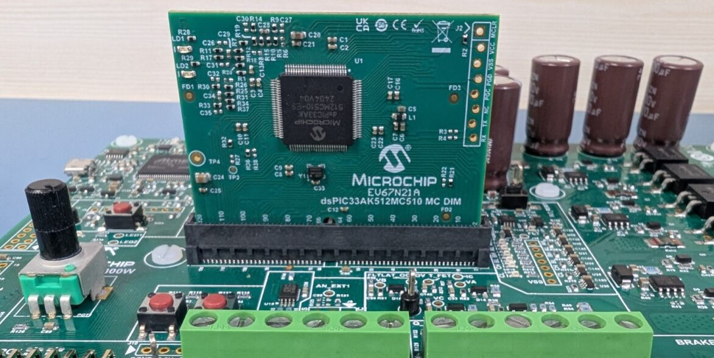
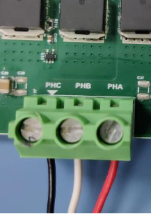
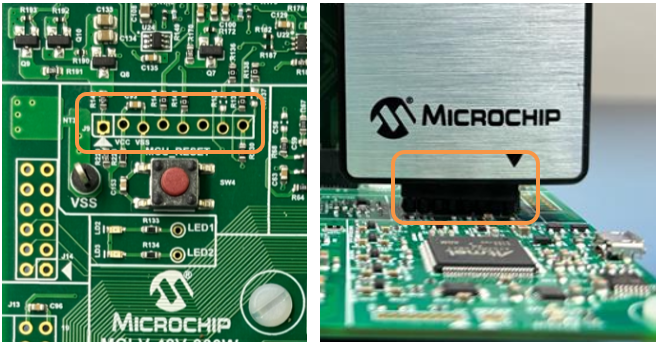
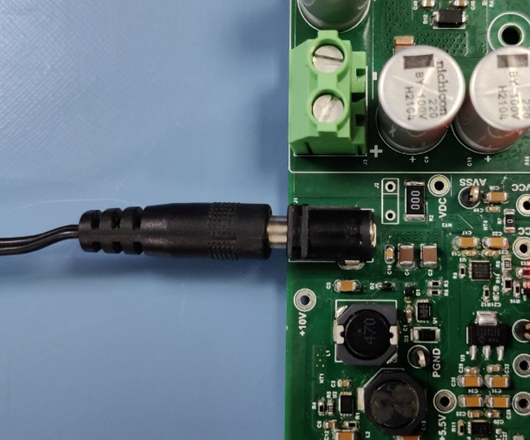
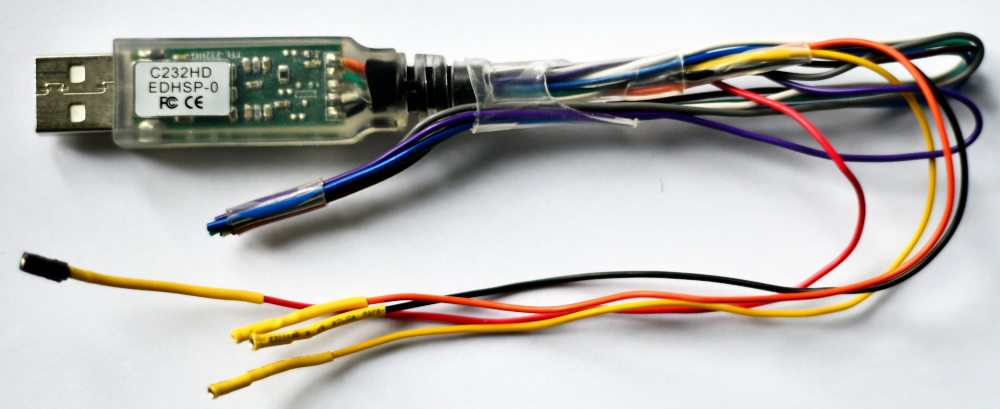

# 01 — Hardware Requirements & Safety

> Read this **before** the lab. The safety section is not optional.

---

## 1. Bill of materials (per bench)

| Item | Part | Notes |
|------|------|-------|
| Motor-control baseboard | **MCLV-48V-300W** | low-voltage motor-control development board |
| Processor module (DIM) | **dsPIC33AK512MC510 DIM** | 200 MHz dsPIC33A, plugs into the DIM connector |
| Motor | **ACT 57BLF02** PMSM | 3-phase, with **Hall sensors** |
| Power supply | 24 V DC bench PSU | current-limited (see §Safety) |
| Programmer/debug + host link | on-board **PKoB4** (USB) | your PC link in the standard setup |
| USB cable | USB-A ↔ micro/USB-C (board dependent) | to the PKoB4 (J16) connector |
| *(optional)* FTDI USB-serial cable | **C232HD** (3.3 V EDHSP-0) | high-bandwidth link — see §3b |
| PC | Windows, MATLAB R2025b installed | see `02_Software_Setup.md` |

*Photo: dsPIC33AK512MC510 MC DIM (EV67N21A) seated on the MCLV-48V-300W board. From the MTR4 class on sensorless FOC (identical hardware).*

---

## 2. Cabling

1. **Motor phases** → the MCLV-48V-300W phase terminals **PHA / PHB / PHC**. Screw terminals firm.
2. **Hall sensor cable** → the Hall/encoder header on the board (keyed connector).
3. **DIM module** → seated fully in the DIM connector, alignment triangle matched. *Power off while inserting.*
4. **USB** (on-board PKoB4) → PC (connector **J16**). This carries **programming, debug, and
   External Mode data**. (Alternatively a PICkit 5 on ICSP header **J9**.)
5. **DC power (24 V)** → the board's DC input, **last**, and only after a jumper check (§4).

*Photo: motor 3-phase leads on the PHA/PHB/PHC terminals. From the MTR4 class on sensorless FOC (identical hardware).*

*Photo: seating the DIM (match the alignment triangle) and the 24 V DC input. From the MTR4 class on sensorless FOC (identical hardware).*

*Photo: 24 V DC barrel-jack power connection. From the MTR4 class on sensorless FOC (identical hardware).*

---

## 2b. Interactive pinout (DIM viewer)

To see exactly which **DIM pin / MCU pin** carries each board signal (motor phases, Hall, ADC,
PWM, LEDs, buttons, UART), open Microchip's interactive **DIM viewer** for *this* board + DIM:

> **Pinout — MCLV-48V-300W + dsPIC33AK512MC510 DIM:**
> <https://mplab-blockset.github.io/MPLAB-Device-Blocks-for-Simulink/tools/dim_viewer/%23dim=dsPIC33AK512MC510%26bb=MCLV%26sort=function%26grp=1%26alt=0%26mc=1>

The link is pre-set to our hardware (`dim=dsPIC33AK512MC510`, `bb=MCLV`), grouped and
sorted by function. Use it to confirm a pin before wiring, or to find where a signal (e.g. the
`Ha`/`Hb`/`Hc` Hall inputs, `PWM`, or `LED` on **E2**) lands on the DIM/MCU. You don't need to
memorise pins — the board template already maps them — but this is the authoritative reference if
you ever need to check one.

---

## 3. The data link is limited — how much depends on the cable

The same USB cable carries two things: **PKoB4 programming/debug** (used to flash the board) **and**
a **CDC UART** used by External Mode for live data and tuning. Flashing is **not** limited by the
UART baud rate; the **data/tuning** path is.

- **Onboard PKoB4 UART** — the default link, **capped at 460 800 baud**. You *can* stream 20 kHz
  control data, but only a **limited number of signals** at once before the link saturates.
- **Optional FTDI cable** (§3b) — a higher-bandwidth UART that lets you stream **more signals** at
  the full rate.

**Consequence with the onboard link:** in Lab 3 you **down-sample** the logged signal to a few
hundred Hz so several signals fit the 460 800-baud link — enough to *see* the waveform shape. The
full-rate **bench logs** used in Lab 4 were captured on the instructor bench (higher-bandwidth path).

### 3b. Optional: FTDI cable for a high-bandwidth link

An **FTDI USB-serial cable** (C232HD) gives a much faster link than the onboard PKoB4 UART — useful when you
want to stream more External-Mode signals at once. Wire it to the DIM's **UART2** (the port our
models use for high-bandwidth data): FTDI **RX ← TX**, **TX → RX**, **GND ↔ GND** (leave the FTDI
VCC unconnected; the board is self-powered). Benefit: **high bandwidth**.

*C232HD FTDI USB-serial cable. Confirm the exact UART2 pins in the DIM viewer (§2b).*

---

## 4. Jumper / configuration check (before power)

- Confirm the board is set for the **PMSM / MCLV** motor profile per the board silk-screen.
- Confirm the DC input jumper matches the **24 V** external supply (not USB-powered motor stage).
- Confirm the DIM is fully seated and the correct part (`dsPIC33AK512MC510`).
- **Current-sense op-amp:** this DIM uses the processor's **internal op-amps** (internal-op-amp
  configuration). If your board/DIM were wired for external amplifiers you would change the shunt
  jumper resistors — not needed here; the template is set for internal op-amps.

### Board operator controls

The MCLV-48V-300W has on-board controls the *reference firmware* maps to motor functions. In **our**
Simulink labs we drive everything live over External Mode (e.g. the speed reference `wref`), so the
push-buttons are **not** used:

| Control | Function in our labs |
|---------|----------------------|
| **SW1** | unused |
| **SW2** | unused |
| **POT1** | analog input (ADC-read on the target); its value can be displayed/logged over External Mode. In Labs 1–5 the main speed reference is tuned from the host over External Mode unless a model maps POT1 to `wref`. |
| **LED1 / LED2** | status indication |

> The optional **Lab 5-bis** (Motor Control Blockset demo) is different: its reference firmware *does*
> use **SW1** (start/stop) and **POT** (speed) as described in that demo's README.

> If unsure, **ask the instructor before applying DC power.** A wrong jumper can
> damage the board or the motor.

---

## 5. ⚠️ Safety — read before any motor spin-up

The motor **will spin** in Lab 3, Lab 5, and the optional Lab 5-bis. Treat it as moving machinery.

- **Mount the motor** so it cannot move, walk off the bench, or throw the shaft. No loose motors.
- **Keep hands, hair, cables, and tools clear** of the rotor and shaft at all times.
- **Set the PSU current limit** to the value the instructor specifies (start low). A current
  limit is your first line of defence against a wiring fault.
- **Start at low speed.** All labs begin with a low speed reference. Increase only when stable.
- **Know the stop:** the model's **Stop** button (simulation/External Mode) halts the drive;
  the **PSU output switch** is the hard cut. Keep a hand near the PSU switch during first spin-up.
- **Abnormal signs → stop immediately** and cut DC power:
  - loud buzzing / grinding, strong vibration,
  - motor gets hot fast, smell of burning,
  - PSU hits its current limit and stays there,
  - the shaft jerks instead of turning smoothly.
- **Never** insert/remove the DIM, motor, or Hall connector while DC power is applied.
- **Power-down order:** stop the drive or reduce speed → PSU output OFF → then unplug.

---

## 6. Bench checklist (tick before starting Lab 1)

- [ ] Motor mounted, phases + Hall connected.
- [ ] DIM seated, correct part.
- [ ] USB to PC connected, board enumerates a COM port (`02_Software_Setup.md`).
- [ ] Jumpers verified for 24 V / MCLV profile.
- [ ] PSU set to 24 V, current limit at instructor value, output **OFF**.
- [ ] You have read §Safety.

Once every box is ticked, continue to **`02_Software_Setup.md`**.
