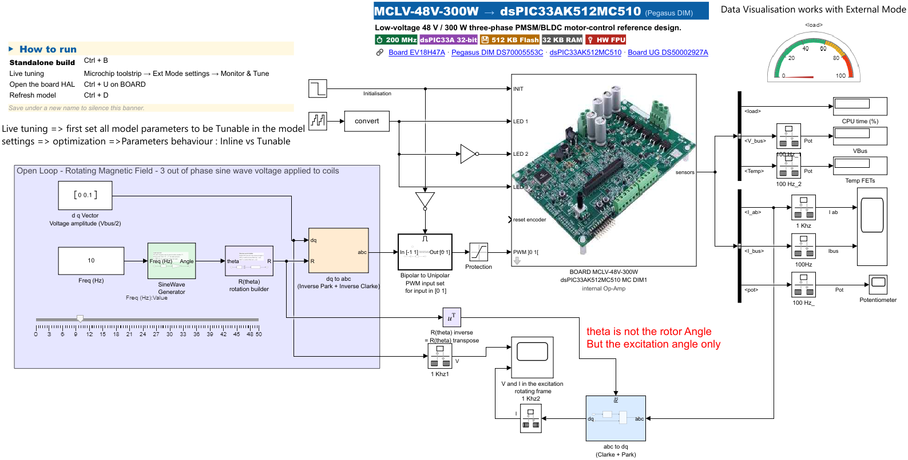

# 02b — Start from the Microchip board template

Before the motor labs (Lab 3 onward) you need a model that already knows about **your board** —
its pins, ADC channels, PWM, op-amps, LEDs and the processor. You do **not** build that by hand:
the MPLAB Device Blocks toolbox ships a ready-made **board template**. You create a new model
**from that template** and start adding your control on top.

> Our lab models were themselves created this way. This page shows you the exact steps so you can
> reproduce them or start a fresh one.

---

## 1. Which template to pick

For this bench (MCLV-48V-300W + dsPIC33AK512MC510 DIM), pick exactly:

> ### `MCHP_MCLV48V300W_dsPIC33AK512MC510_DIM`

Read the name left-to-right — it encodes the hardware:

| Part of the name | Meaning |
|------------------|---------|
| `MCHP` | Microchip board template |
| `MCLV48V300W` | the **MCLV-48V-300W** baseboard |
| `dsPIC33AK512MC510` | the **processor** on your DIM |
| `DIM` | the module form factor (Dual-In-line Module) |

> ⚠️ Do **not** pick a template with a different board (`MCLV2`, `MCHV`, `LVMC`) or a different
> processor (`dsPIC33CK…`, `AK128…`, `AK256…`). The pin map and peripherals would be wrong.

---

## 2. Create the model from the template (GUI — no command line)

### Option A — Simulink Start Page (recommended)

1. In MATLAB: **New → Simulink Model** (or **Home → Simulink**) to open the **Simulink Start Page**.
2. Scroll to the **Microchip / MPLAB Device Blocks** template group.
3. Click the tile **`MCHP_MCLV48V300W_dsPIC33AK512MC510_DIM`**.
4. A **new untitled model** opens with the board in place.
5. **Save it under your own name** immediately: **File → Save As → `MyMotorModel.slx`**.

### Option B — Microchip toolstrip “board templates”

1. Open any Simulink model so the **Microchip** ribbon tab is visible, and click it.
2. In the **File** section, click **board templates**.
   *(Tooltip: “Create a new model from a Microchip board template (LVMC, MCLV2, Curiosity Nano…)”.)*
3. A **card picker** opens showing every Microchip board template as a thumbnail. Click the card
   **`MCHP_MCLV48V300W_dsPIC33AK512MC510_DIM`**.
4. Simulink opens a **new untitled model** pre-populated with your board.
5. **Save As → `MyMotorModel.slx`** before editing.

Either way you get the same starting model:

---

## 3. What you get (and what to keep)

The new model already contains, ready to use:

- 🟩 **BOARD MCLV-48V-300W / dsPIC33AK512MC510** subsystem — the **HAL**: it exposes the board's
  `INIT`, `LED`, `PWM`, and a `sensors` bus (`V_bus`, `Temp`, `I_ab`, `I_bus`, `pot`). *Open it with
  `Ctrl+U`* to see the pin configuration, but you normally don't edit it. (For the exact DIM/MCU pin
  of any signal, use the interactive DIM viewer linked in `01_Hardware_Requirements.md` §2b.)
- The **Clarke/Park** and **inverse Park/Clarke** transform blocks.
- A small **open-loop rotating-field** example (sine generator → `dq→abc`) so the board does
  something out of the box.
- **Data-visualisation** scopes/gauges already wired to the sensor bus and set up for **External Mode**.
- A **"How to run"** note card (Standalone build `Ctrl+B`, Live tuning via Monitor & Tune, `Ctrl+U`
  to open the BOARD HAL, `Ctrl+D` to refresh).

**Keep** the BOARD subsystem and the transforms. **Replace** the open-loop example with your own
control (the PLL observer / FOC in Lab 5). That is exactly how our `Lab3` and `Lab5` hardware models
were built.

> 💡 The template banner reminds you: for **live tuning**, first set the model parameters you want
> to tune to **Tunable** (Model Settings → Optimization → *Default parameter behavior: Tunable*),
> then use Monitor & Tune (External Mode) — the same link you used in Lab 2.

---

## 4. Save-as first, then work

The template opens as **untitled**. Use **File → Save As** and give it your own name **before**
editing, so the original template stays clean for the next time. Then continue to the motor labs —
they each start from this same board template.

---

> 📌 **Pinout reference** — which DIM/MCU pin carries each signal (motor phases, Hall, ADC, PWM, LED, UART), for cabling any peripheral:
> [**MCLV-48V-300W + dsPIC33AK512MC510 DIM viewer**](https://mplab-blockset.github.io/MPLAB-Device-Blocks-for-Simulink/tools/dim_viewer/%23dim=dsPIC33AK512MC510%26bb=MCLV%26sort=function%26grp=1%26alt=0%26mc=1)
