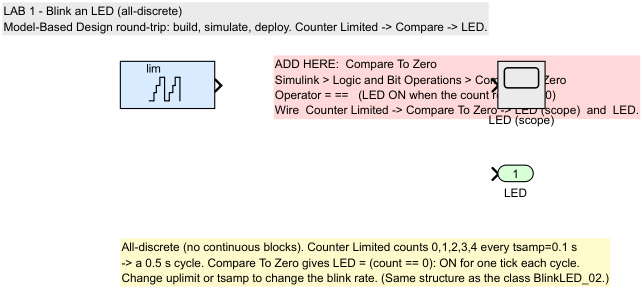
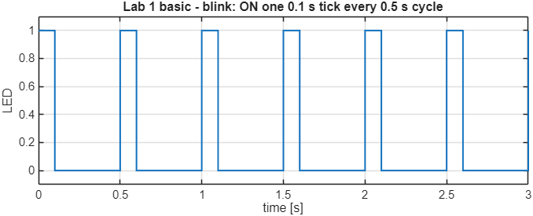
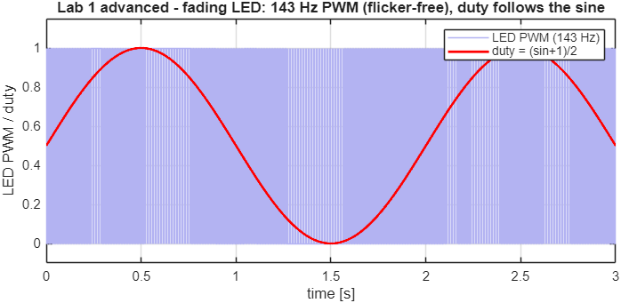
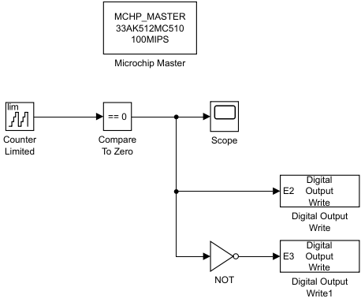

# 03 — Lab 1: Blink an LED

**Goal:** your first Model-Based Design round-trip — build a model, **simulate** it,
then **deploy** it to the dsPIC33A and see a real LED blink. No motor yet.

**Time:** ~45 min (15 sim + 30 deploy) · **Build+flash:** ✅ required (your first)
**Folder:** `Lab_v2\Lab1_BlinkLED\`

---

## Why this lab

Everything later (External Mode, logging, observers) is the same round-trip you learn
here: *draw a model → simulate → generate code → flash → observe on hardware.*
We keep it to a single blinking LED so the **workflow** is the only new thing.

> **All-discrete design.** These early models use **no continuous-time blocks** — a
> **Counter Limited** runs at a fixed sample time and drives the LED. This matches how the code
> runs on the chip (a fixed-rate task) and keeps the model single-rate and simple. The structure
> mirrors the classic class labs `BlinkLED_02` (basic) and `BlinkLED_03` (fading).

---

## Files in this folder

| File | What it is |
|------|------------|
| `Lab1_LED_SIM_START.slx` | **the model you complete** — Part A and Part B both happen here |
| `Lab1_LED_SIM_SOLUTION.slx` | the Part-A answer (simulation only) |
| `Lab1_LED_HW_REFERENCE.slx` | the Part-B answer / known-good deploy model — open this if your own build misbehaves |
| `Lab1_LED_FADE_DEMO.slx` | **optional:** a *fading* (brightness-ramp) LED, simulate **or** build |

---

## Part A — Simulation (you add 1 block)

1. Open the model to complete:

   ```matlab
   cd 'D:\26061_MTR6\Lab_v2\Lab1_BlinkLED'
   open Lab1_LED_SIM_START.slx
   ```

2. The model already has a **Counter Limited** (counts `0,1,2,3,4` every `tsamp = 0.1 s` → a 0.5 s
   cycle), a **Scope**, and an `LED` output. The **compare is missing** — a pink placeholder marks
   where it goes.

   

3. **You add:** a **Compare To Zero** block.
   - Library Browser → *Simulink → Logic and Bit Operations → **Compare To Zero***.
   - Set **Operator = `==`** (LED ON when the count returns to 0).
   - Wire `Counter Limited → Compare To Zero → LED (scope)` and `→ LED`.

   This turns the LED **ON for one tick** each time the counter wraps to 0 — a periodic blink.

4. **Run** (▶). The Scope shows the LED pulsing **once every 0.5 s cycle**.

   

> ✅ **Checkpoint A:** Scope shows a periodic pulse (ON one 0.1 s tick per 0.5 s cycle). If not,
> check the Compare operator (`==`) and that the wire reaches the Scope.
>
> Stuck? Open `Lab1_LED_SIM_SOLUTION.slx` and compare. (Same structure as the class `BlinkLED_02`.)

---

## Part A+ — Advanced: a *fading* LED (optional)

Open `Lab1_LED_FADE_DEMO.slx`. Instead of ON/OFF, it dims the LED with **PWM** — the
same technique as the class `BlinkLED_03`:

```
duty    = (sin(2*pi*f*t) + 1)/2      slowly varies 0 → 1 → 0   (a sine)
carrier = Counter 0..6 @1 kHz        normalised to 0..1        (the PWM carrier)
LED     = (carrier < duty)           a PWM whose duty follows the sine
```

The LED is ON a fraction `duty` of each carrier cycle, so its **average brightness follows the
sine** — the LED fades in and out. Still fully discrete.

> **Why a small (0..6) carrier?** At the 1 kHz base rate the PWM frequency is `1000/(N+1)`. With
> **N = 6** that is **~143 Hz** — above the human flicker-fusion threshold (~90 Hz), so the eye sees a
> smooth brightness with little or no visible flicker for most observers. A large counter (say 0..99)
> would drop the PWM to ~10 Hz — which
> *would* flicker visibly. Brightness is quantised to 7 steps, but the slow duty sweep still looks
> smooth. (This matches the class `BlinkLED_03`, which also uses a 0..6 carrier.)

Run it: the red **duty** curve is a clean sine and the blue **LED PWM** pulses get denser (brighter)
/ sparser (dimmer) accordingly:



> This is real *pulse-width modulation* — the same basic PWM principle used later to drive the motor
> phases (the motor uses three-phase PWM through the inverter).

---

## Part B — Deploy to hardware (build + flash)

Stay in **the same model** you just simulated. Only **two blocks** turn it into a real embedded
application — you add them yourself, because that is the whole lesson of Part B.

1. **You add block 1 — `Microchip Master`.**
   Library Browser → *MCHP_Blockset → System Configuration → **Microchip Master***.
   Drop it anywhere on the canvas (it has no ports — it configures the chip), then open it and set:
   - **board / chip = `dsPIC33AK512MC510`**
   - **200 MIPS**

   > Dropping this one block **retargets the whole model**: the solver switches to fixed-step
   > discrete, the sample time becomes 1 ms, and a **Microchip** tab appears in the ribbon.
   > That is why the model is now buildable at all.

2. **You add block 2 — `Digital Output Write`.**
   Library Browser → *MCHP_Blockset → Digital IO → **Digital Output Write***, set the pin to
   **E2** (the on-board LED), and wire it from `Compare To Zero`.
   This is the block that turns a model signal into a real pin toggle on silicon.

   

   > The reference model adds a third touch — a `NOT` block into a second `Digital Output Write`
   > on **E3** — so the two LEDs blink in anti-phase. Optional.

3. Make sure the board is **powered (USB)** and its **COM port** is present (`02` §3).

4. Click **Build, Deploy & Start** (Hardware tab, or **Ctrl-B**). MATLAB will generate C code,
   compile with XC-DSC, flash the dsPIC33A, and start it.

   > ⏱ ~**2–4 min** the first time. Watch the Diagnostic Viewer — it is not stuck.

4. When it finishes, the **on-board LED blinks at 1 Hz**. 🎉 You just ran your model on silicon.

   > **Expected:** the LED next to the DIM blinks about once per second, and the second LED
   > blinks in anti-phase (it is driven through the `NOT` block from the same signal).

> ✅ **Checkpoint B:** LED blinks ~once per second. If it doesn't:
> - COM port missing → replug USB, check Device Manager (`02` §3).
> - Build error → see `09_Troubleshooting.md` §Build.
> - Anything else → open **`Lab1_LED_HW_REFERENCE.slx`**, the known-good deploy model, and
>   compare it with yours. Build that one to prove the bench is fine, then come back.
>
> ⏱ **Time gate:** if this takes more than ~10 min, build `Lab1_LED_HW_REFERENCE.slx` and move on.

---

## Try it (optional, 2 min)

Change the counter limit (or `Ts`) in the hardware model and rebuild — the LED blinks faster or
slower. This is the whole point of MBD: change the model, regenerate, and the behaviour changes on
the chip — no hand-written C.

> In Lab 2 you'll change the rate **live**, without rebuilding, using External Mode.

---

## What you learned

- The MBD round-trip: model → simulate → generate code → flash → observe.
- Early models are **all-discrete** (a Counter Limited at a fixed sample time), matching how code runs on the chip.
- Basic blink = Counter → Compare To Zero (like `BlinkLED_02`); fading = sine-modulated PWM duty vs a fast carrier (like `BlinkLED_03`).
- A discrete source drives an output; on hardware that output is a real pin (or a PWM signal for the fade).
- Build+flash on this target is a few minutes — plan for it.

Continue to **`04_Lab2_ExternalMode.md`**.

---

> 📌 **Pinout reference** — which DIM/MCU pin carries each signal (motor phases, Hall, ADC, PWM, LED, UART), for cabling any peripheral:
> [**MCLV-48V-300W + dsPIC33AK512MC510 DIM viewer**](https://mplab-blockset.github.io/MPLAB-Device-Blocks-for-Simulink/tools/dim_viewer/%23dim=dsPIC33AK512MC510%26bb=MCLV%26sort=function%26grp=1%26alt=0%26mc=1)
