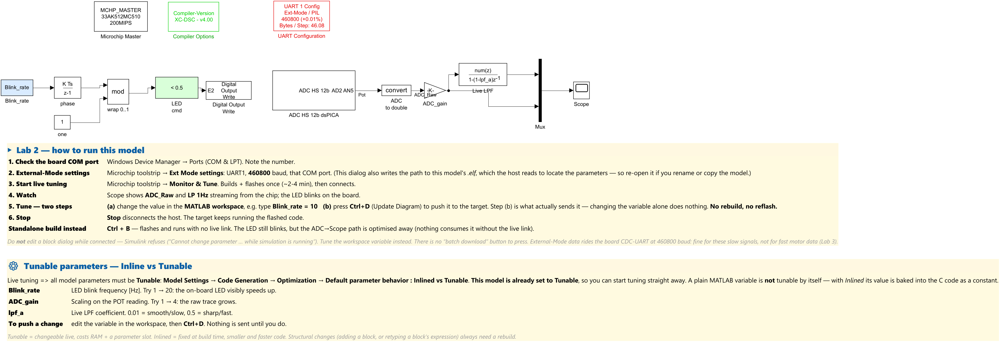

# 04 — Lab 2: External Mode (live tuning & scoping)

**Goal:** talk to the running chip **while it runs** — change a parameter and watch a
signal live over the USB link, **without rebuilding**.

**Time:** ~25 min · **Build+flash:** ✅ required (once)
**Folder:** `Lab_v2\Lab2_ExternalMode\`

---

## Why this lab

Rebuilding for every change (Lab 1) is slow. **External Mode** keeps the model
connected to the target: you **tune parameters** and **scope signals** in real time.
This is how you'll observe the motor later.

We stay on the LED + a potentiometer so the *only* new idea is the **live link**.

---

## Files in this folder

| File | What it is |
|------|------------|
| `Lab2_ExtMode_hw.slx` | **the one Lab-2 model** — already complete, already configured for Monitor & Tune |
| `startup_lab2.m` | declares the three tunable parameters (runs automatically from the model's PreLoadFcn) |

> There is **nothing to draw** in this lab. Lab 2 is about *configuring* and *operating*
> the live link, so the model ships finished. Read the two cards on the canvas — they
> contain the whole procedure.



---

## What is in the model

| Part | Blocks | Role |
|------|--------|------|
| Blink path (tunable rate) | `Blink_rate` → `phase` → `wrap 0..1` → `LED cmd` → `Digital Output Write E2` | blinks the board LED at `Blink_rate` Hz |
| Observation path | `ADC HS 12b` → `ADC to double` → `ADC_gain` → `Live LPF` → `Mux` → `Scope` | streams the POT reading raw + filtered |
| Infrastructure | `Microchip Master`, `UART Configuration`, `Compiler Options` | target = `dsPIC33AK512MC510` @ 200 MIPS; UART1 @ 460 800 baud, DMA circular buffer |

The **blink rate has to be built from a phase accumulator** rather than a `Counter Limited`:
a counter's period comes from its *mask* parameters (`uplimit`, `tsamp`), and mask parameters
are structural — they can never be changed on a running target. A value that feeds a
`Constant`/`Gain` block *can*.

---

## The link, and its limit

External Mode data and tuning travel over the board's **CDC UART, capped at 460 800 baud**
(the same USB cable also carries PKoB4 programming/debug, which is *not* limited by that
baud rate). 460 800 baud is plenty for a few slow signals; a **limited** number of signals
can be streamed at higher rates before it saturates — remember that for Lab 3.

---

## ⚙️ Before you connect — check the External-Mode settings

1. Open the model, click the **Microchip** ribbon tab.
2. In the **Settings** section click **Ext Mode settings**.
3. Check that it matches the board:
   - **Transport = XCP**, **UART1**, **baud = 460 800** (must equal the UART Configuration
     block in the model),
   - the **COM port** = the board's port (from `02_Software_Setup.md` §3),
   - External Mode **enabled**.
4. Close the dialog with **OK** — even if you changed nothing.

> ⚠️ **Why "even if you changed nothing":** this dialog also writes the path to **this
> model's `.elf`** into the model. The External-Mode host reads that ELF to find where the
> parameters live in the chip's memory. If the path is missing or points at a *different*
> model — which is what happens when a model is **renamed or copied** — then **Monitor &
> Tune fails completely silently**: no error, no message, the status simply never leaves
> *stopped*. Re-opening this dialog and pressing OK repairs it.
> (This exact fault was found and fixed in this lab model on 2026-08-10.)

---

## Tunable vs Inlined — why this matters

By default the code generator **inlines** parameters: their values are baked into the C
code as constants, so nothing can change them on the target.

- **This model is already set to `Tunable`** (*Model Settings → Code Generation →
  Optimization → Default parameter behavior*), so you can tune immediately.
- **A plain MATLAB variable is _not_ tunable by itself.** Under *Inlined*, `Blink_rate = 5`
  is compiled to the literal `5` and disappears. Wrapping it in a `Simulink.Parameter`
  changes nothing either, *unless* you also give it a storage class such as
  `SimulinkGlobal` — that is the lean way to expose just a few parameters while everything
  else stays inlined.

> Rule of thumb: **Tunable** = changeable live, costs RAM + a parameter slot.
> **Inlined** = fixed at build time, smaller and faster code.

---

## Run it: Monitor & Tune

1. Power the board and confirm the COM port (`02` §3).
2. **Microchip** ribbon → **Monitor & Tune**.
   MATLAB builds + flashes once (~2–4 min) and then **connects** over the 460 800-baud UART.
3. Once connected, the **Scope shows the live signals** — `ADC_Raw` and `LP 1Hz` streaming
   from the chip — and the LED blinks on the board. Turn **POT1** and watch both traces move.

> ✅ **Checkpoint 1:** the Scope updates continuously and POT1 moves the traces.
> If the status never leaves *stopped*, re-do the **Ext Mode settings** step above (the ELF
> path). If the build complains that no UART is configured for External Mode, open the UART
> Configuration block and tick **Use this UART for External Mode (or PIL)**.

---

## Tune it live — **two steps, and the second one is the one people forget**

While connected:

1. **Change the value in the MATLAB workspace**, e.g. type in the Command Window:

   ```matlab
   Blink_rate = 10;
   ```

2. **Press `Ctrl+D`** (*Update Diagram*) — *this* is what pushes the new value to the chip.

Changing the variable **alone does nothing**: Simulink does not watch the workspace, so
until you press `Ctrl+D` the target keeps running the old value. Measured on this bench:
setting `ADC_gain` from 1 to 2 left the streamed signal at exactly its old value; after
`Ctrl+D` it doubled precisely.

Things to try (each time: edit the variable → `Ctrl+D`):

| Parameter | Try | What you should see |
|-----------|-----|---------------------|
| `Blink_rate` | `5` → `10` → `20` | the on-board LED visibly speeds up |
| `ADC_gain` | `1` → `2` → `4` | the raw trace grows proportionally |
| `lpf_a` | `0.05` → `0.2` → `0.01` | the filtered trace gets sharper / smoother |

> ✅ **Checkpoint 2:** behaviour changes **without rebuilding** — no code generation, no
> flashing, just `Ctrl+D`.

### Two things *not* to do

- **Do not edit a block dialog while connected.** Simulink rejects it outright
  (*"Cannot change parameter … while simulation is running"*). Retyping a block's expression
  is a structural change. Tune the **variable** instead.
- **There is no "batch download" button** to press in this flow, and no External-Mode
  Control Panel step. `Ctrl+D` is the whole mechanism.

**Stop** disconnects the host; the target keeps running the flashed code.

---

## The discrete low-pass filter (`Live LPF`)

The measured signal passes through a tunable first-order discrete low-pass
(`Numerator = lpf_a`, `Denominator = [1 -(1-lpf_a)]`). Tune `lpf_a` live and watch the trace
smooth/sharpen — a preview of the signal conditioning you'll want on noisy motor
measurements.

> Note for the curious: `lpf_a` appears **twice** in that filter, so the code generator
> emits one directly-tunable coefficient plus one *computed* coefficient derived from it.
> Both are refreshed together when you press `Ctrl+D` — verified on hardware, the filter's
> DC gain stays exactly 1.000 at `lpf_a` = 0.05 and 0.20.

---

## What you learned

- External Mode = live parameter tuning + signal scoping over the USB-UART link.
- **Two prerequisites:** the Microchip **Ext Mode settings** must match the board *and*
  carry this model's own `.elf` path; parameters must be **Tunable**.
- **The tuning gesture is: edit the workspace variable, then `Ctrl+D`.** Nothing is sent
  before that. Block dialogs cannot be edited while connected.
- A parameter is only tunable if the build made it one — a plain variable under *Inlined*
  is compiled away to a constant.
- The link is fine for slow signals — but not for fast motor data (next lab).

Continue to **`05_Lab3_HallLog.md`**.

---

> 📌 **Pinout reference** — which DIM/MCU pin carries each signal (motor phases, Hall, ADC, PWM, LED, UART), for cabling any peripheral:
> [**MCLV-48V-300W + dsPIC33AK512MC510 DIM viewer**](https://mplab-blockset.github.io/MPLAB-Device-Blocks-for-Simulink/tools/dim_viewer/%23dim=dsPIC33AK512MC510%26bb=MCLV%26sort=function%26grp=1%26alt=0%26mc=1)
