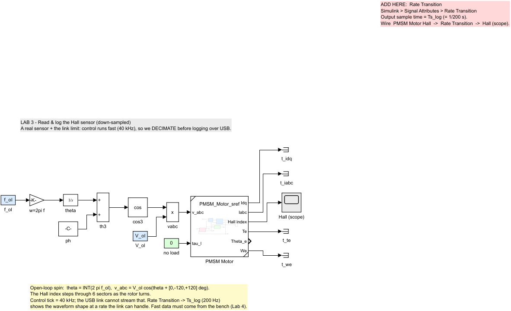
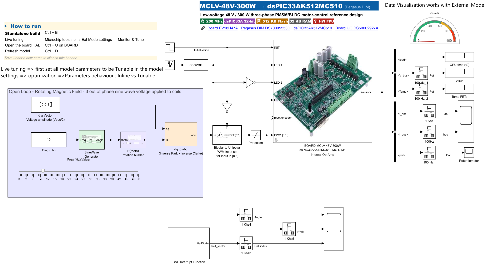

# 05 — Lab 3: Read & log the Hall sensor (down-sampled)

**Goal:** turn the motor for the first time, read its **Hall sensors** (rotor angle),
and **log** that signal to the PC — at a rate the USB link can handle.

**Time:** ~20 min · **Build+flash:** ⚙️ guided (instructor-led; solution ready if it slips)
**Folder:** `Lab_v2\Lab3_HallLog\`

> ⚠️ The motor spins in this lab. Re-read `01_Hardware_Requirements.md` §Safety.
> Start at low speed, keep a hand near the PSU switch.

---

## Why this lab

To control a motor you must **measure** it. The Hall sensors give a coarse rotor
angle. We read them on-target, then **log** the angle so you can see the rotor turn on
the PC.

> **This is the first motor lab, so the HARDWARE model is built from the Microchip board template**
> `MCHP_MCLV48V300W_dsPIC33AK512MC510_DIM` (see `02b_Create_From_Template.md`). Two models ship:
>
> | Model | Role |
> |-------|------|
> | `Lab3_HallLog.slx` / `_solution.slx` | **simulation** — plant + open-loop V/f, you add the Rate Transition (safe, no board) |
> | `Lab3_HallLog_hw_solution.slx` | **hardware** — the real template-based model: BOARD HAL, open-loop V/f drive, Hall read by a **Change-Notification (CN) interrupt** on the 3 Hall inputs (Ha/Hb/Hc), currents/voltage/pot from the sensor bus, logged over External Mode. Target = dsPIC33A, 20 kHz. Deploy this to spin the motor and log for real. |
>
> The HW model already includes the BOARD HAL + Hall CN interrupt from the template — you don't
> rebuild the pin/ADC/Hall configuration by hand. This is exactly the model used to record the bench
> logs you replay in Lab 4.

---

## The one new idea: down-sample before you log

The control runs fast (e.g. **20 kHz**). Streaming a 20 kHz signal over 460 800 baud
**will not fit** — External Mode would stall or drop data. So we insert a **Rate
Transition** that decimates the signal to a few hundred Hz (default **200 Hz**, up to
1 kHz if stable). At 200 Hz you can't reconstruct fast transients, but you **clearly
see the Hall sector step through its 6 states** (and a coarse 6-step angle staircase) as the motor
turns — which is the point.

```
 20 kHz  ── Hall sector ──▶ coarse angle ──▶ [ Rate Transition 200 Hz ] ──▶ log/scope over USB
 (fast, on-chip)                          ^ YOU ADD THIS TAP
```

For *fast, identification-grade* data you don't capture it here — we hand you our
**bench logs** in Lab 4.

---

## What's already in the model

The ADC read, the **Hall decode**, and the low-speed **open-loop spin** are all
pre-built (peripheral setup is fiddly and not the lesson). You will see:

- 🟩 `Hall` input → decoded rotor **angle**,
- 🟦 a low open-loop **speed reference**,
- ⬜ a **Hall-angle Scope** and a **To Workspace** logging sink (`hall_log`),
- a placeholder **“ADD HERE: Rate Transition (Ts_log)”** on the angle-to-log path.



---

## You add: the Rate Transition tap

1. Open the student model:

   ```matlab
   cd 'D:\26061_MTR6\Lab_v2\Lab3_HallLog'
   open Lab3_HallLog.slx
   ```

2. **You add:** a **Rate Transition** block (*Simulink → Signal Attributes → Rate Transition*) on
   the placeholder, feeding the scope + `hall_log`. **Set its `Output port sample time` = `Ts_log`**
   (= 1/200 s) in the block dialog, then wire it in.

3. Everything else is done. Save.

---

## Run it (guided, on hardware)

Lab 3 runs on the **template hardware model** over **External Mode** — you drive the motor open-loop
at a **fixed frequency** and watch the Hall reading come back live.

1. **Safety:** motor mounted, PSU at 24 V / instructor current limit, output **ON**.
2. Open **`Lab3_HallLog_hw_solution.slx`** and click **Monitor & Tune** (External Mode). It
   builds+flashes once (~2–4 min) and connects.

   

3. Set the open-loop drive **electrical frequency** (the `Freq (Hz)` block / slider, e.g. **10 Hz
   electrical** — with 4 pole-pairs that is 2.5 Hz mechanical). The board
   applies a rotating three-phase voltage and the motor spins slowly. A **CN interrupt** reads the
   3 Hall inputs each edge and decodes the **Hall sector**.
4. On the External-Mode scopes you see the **Hall sector step through its 6 states** (a coarse 6-step
   angle staircase), repeating as the rotor turns — a *coarse* angle, because a Hall sensor only
   resolves 6 sectors per electrical revolution. Change the frequency and the steps speed up.

> ✅ **Checkpoint:** a repeating 6-step Hall staircase on the External-Mode scope, in step with the
> turning rotor. If the motor doesn't turn or the sectors look random → `09_Troubleshooting.md`
> §Motor / §Hall.

> The **simulation** model `Lab3_HallLog.slx` (where you added the Rate Transition above) reproduces
> the same Hall staircase off-line — handy to check the down-sampling with no board.

---

## What you learned

- Read a real sensor (Hall) on-target and decode rotor angle.
- **Down-sample** before logging so the signal fits the link.
- Slow logs are fine to *visualise*; fast, accurate data needs a proper bench capture (Lab 4).

Continue to **`06_Lab4_Identify.md`**.

---

> 📌 **Pinout reference** — which DIM/MCU pin carries each signal (motor phases, Hall, ADC, PWM, LED, UART), for cabling any peripheral:
> [**MCLV-48V-300W + dsPIC33AK512MC510 DIM viewer**](https://mplab-blockset.github.io/MPLAB-Device-Blocks-for-Simulink/tools/dim_viewer/%23dim=dsPIC33AK512MC510%26bb=MCLV%26sort=function%26grp=1%26alt=0%26mc=1)
