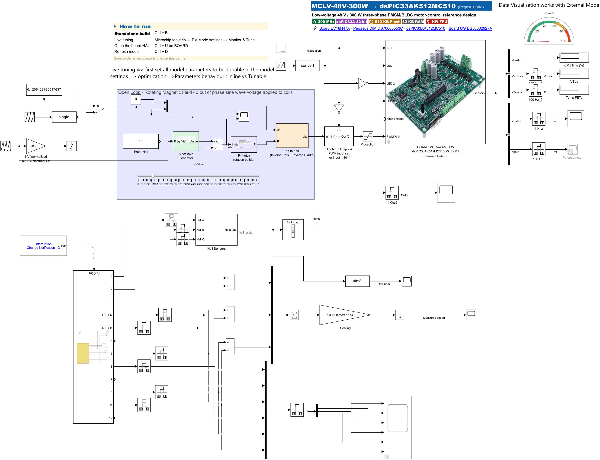
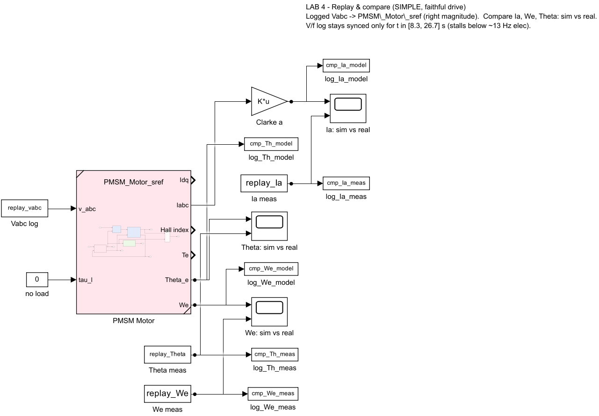
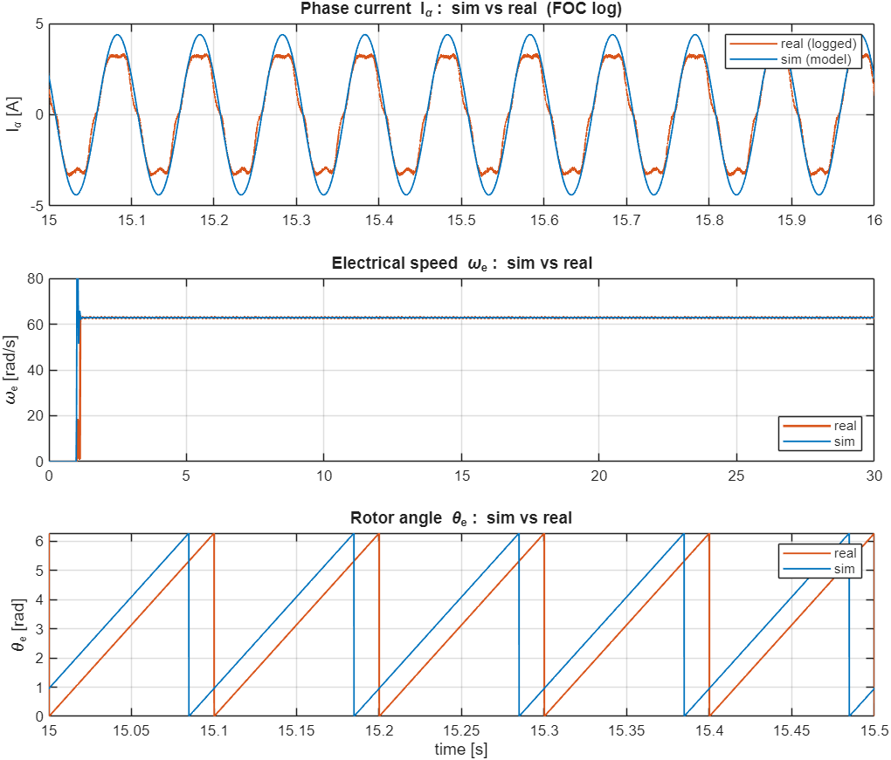

# 06 — Lab 4: From the board template to logged motor data

**Goal:** see how our **bench logs** were produced — a model built **from the Microchip board
template** with a **Hall sensor added** so the motor runs in a simple pseudo-closed loop — then
**replay** one of those logs through the motor model and compare simulation against the real data.

**Time:** ~20 min · **Build+flash:** 💻 simulation (replay) · ✅ optional (run the log model on HW)
**Folder:** `Lab_v2\Lab4_Identify\`

> **Runs on MATLAB R2025b.** You start from the same board template you met in
> `02b_Create_From_Template.md`; the replay part is simulation-only and needs no board.

---

## Why this lab

A model is useful when it captures the motor behaviour **well enough for the control/observer task**.
Before Lab 5's observer, you need (a) a way
to **get real data off the motor**, and (b) a check that the **model reproduces** that data. This lab
shows both: the log-capture model, and a side-by-side replay.

---

## Part A — How the logs were captured (the DataLog model)

Our bench logs were recorded with a model built **from the board template**
`MCHP_MCLV48V300W_dsPIC33AK512MC510_DIM` (see `02b_Create_From_Template.md`), with **Hall sensors
added**. The open-loop rotating field spins the motor while the Hall sensors give a coarse rotor
angle — a simple **pseudo-closed-loop** that keeps the motor turning steadily enough to log clean
data. The control task runs at 20 kHz; the signals are logged over External Mode (on the instructor
bench, using the higher-bandwidth link so several signals fit at full rate — see `01` §3).

```matlab
cd 'D:\26061_MTR6\Lab_v2\Lab4_Identify'
open Lab4_DataLog_hw_solution.slx      % template + Hall sensor + data logging
```



- 🟩 **BOARD MCLV-48V-300W** HAL + **open-loop rotating field** (from the template).
- 🟩 **Hall Sensors** block + **CN interrupt** → `hall_sector` → rotor angle and **measured speed**
  (the added pseudo-closed-loop feedback).
- ⬜ Data-visualisation scopes for `V_bus`, `I_ab`, `pot`, `Hall index`, angle and speed.

> **Optional (hardware):** with the bench powered you can **build & run** this model
> (**Ctrl+B**, then Monitor & Tune) to log your own data. Not required — the class ships clean
> logs already, described below.

---

## Part B — Replay & compare (you do this, in simulation)

Feed the **recorded** logged voltage into the motor model and compare the **simulated** current,
speed and angle against the **real logged** ones.

1. Open the replay model:

   ```matlab
   cd 'D:\26061_MTR6\Lab_v2\Lab4_Identify'
   open Lab4_ReplayCompare.slx
   ```

   Inside: the bench log drives the voltage input `v_abc` of the shared PMSM model
   (`PMSM_Motor_sref`) with load torque zero. The plant outputs and the logged signals go to
   **three scopes** — phase current `Iα`, electrical speed `ωe`, and rotor angle `θe`.

   

   > **What feeds the model.** The opening callback runs `prep_replay_lab4('VF')`, which loads one
   > clean log and publishes `replay_vabc`, `replay_Ia`, `replay_We`, `replay_Theta`. `replay_vabc`
   > is the **actual applied voltage recorded in the log**, so the model sees the recorded voltage
   > magnitude. To try another log, pass a tag (`prep_replay_lab4('FOC')` / `'SixStep'`) or run
   > **`prep_replay_lab4`** with no argument for an interactive menu, then re-run the model (▶).

2. **Run** (▶). Each scope overlays:
   - 🟧 **real (logged)** — the measured motor signal,
   - 🟦 **sim (model)** — the model output for the same voltage in.

3. Read the three scopes:
   - **Speed `ωe`** — sim closely follows the logged steady speed (e.g. ~62.8 rad/s on the FOC log).
   - **Angle `θe`** — sim ramps at approximately the **same slope** as the real rotor; a small
     **constant offset** (a few degrees) is normal because the simulated rotor isn't perfectly aligned
     with the hardware.
   - **Current `Iα`** — similar **frequency** and broadly aligned **phase** with the real current. The
     **amplitude** is the right order of magnitude but not identical: the real current is slightly
     flat-topped (inverter dead-time, current-loop ripple, magnetic saturation) and the open-loop
     replay does not reproduce the load-angle offset exactly. That residual is the kind of modelling
     error an observer must tolerate.

   

   > The overlay above was captured on the **FOC log** (`Log_FOC_fixed_speed.mat`, closed-loop,
   > steady ~10 Hz electrical) via `prep_replay_lab4('FOC')`. The closed-loop log aligns best; the
   > open-loop `'VF'` and `'SixStep'` logs show a larger current-amplitude residual.

> ✅ **Checkpoint:** on the scopes, **speed closely matches**, **angle matches in slope** (small
> offset OK), and **current matches in frequency and phase** (amplitude within roughly 1.3–1.7×
> depending on the log). If a sim trace is flat/zero, the log wasn't loaded — run `prep_replay_lab4`
> (pick a log) and press ▶ again, or see `09_Troubleshooting.md` §Params.

> 🛠️ **Rebuilding the replay model.** If `Lab4_ReplayCompare.slx` is ever missing, run
> `build_lab4_replay` — it wires the plant, the three comparison scopes and the logging blocks.

---

## The provided bench logs

In `Lab4_Identify\logs\` you have three clean bench captures recorded at full rate on the motor rig.
Each holds the same standard signals: applied voltage `Vabc`, phase currents `Iab` (αβ), electrical
`Speed` (in **Hz**), electrical rotor angle `Theta`, and `Hall`.

| `log_index` | Log file | Experiment |
|:-:|----------|------------|
| 1 | `Log_FOC_fixed_speed.mat` | closed-loop FOC, steady ~10 Hz electrical (**used in the figure above**) |
| 2 | `Log_SixStep_Hall.mat`    | six-step (Hall-commutated) spin |
| 3 | `Log_VF_ramp.mat`         | open-loop V/f, electrical frequency ramps 0→50→0 Hz (synced only ~[8.3, 26.7] s) |

`prep_replay_lab4.m` loads one and publishes the replay signals (`replay_vabc`, `replay_Ia`,
`replay_We`, `replay_Theta`, plus `log_index`). Pick with a tag — `prep_replay_lab4('FOC')` — or a
number — `prep_replay_lab4(1)` — or run **`prep_replay_lab4`** with no argument for a menu:

```
>> prep_replay_lab4
Which bench log do you want to replay?
  1) FOC 10Hz  (closed-loop, best match)   [Log_FOC_fixed_speed.mat]
  2) Six-step  (Hall-commutated)           [Log_SixStep_Hall.mat]
  3) V/f ramp  (open-loop, stalls <13Hz)   [Log_VF_ramp.mat]
Enter choice [1-3] (default 1):
```

Besides loading, the helper also runs `params_ACT_57BLF02.m`, converts logged `Speed` (Hz) to `ωe`
(rad/s, ×2π), and selects the α column of `Iab` — so a plain `load` of the `.mat` is **not** enough
to run the model.

> ⚙️ **Speed units.** The logged `Speed` is in **electrical Hz**; the replay converts it to
> **electrical rad/s** (`ωe = 2π·Speed`). With **4 pole-pairs**, mechanical speed = electrical / 4
> (e.g. 10 Hz electrical ≈ 2.5 Hz ≈ 150 rpm mechanical).

---

## What you learned

- Real motor data comes from a model built **on the board template**, with a Hall sensor added for a
  simple pseudo-closed loop.
- A good model **replays** logged data closely; the residual (amplitude, small angle offset) is what
  an observer must handle.

Continue to **`07_Lab5_ObserverSim.md`**.

---

> 📌 **Pinout reference** — which DIM/MCU pin carries each signal (motor phases, Hall, ADC, PWM, LED, UART), for cabling any peripheral:
> [**MCLV-48V-300W + dsPIC33AK512MC510 DIM viewer**](https://mplab-blockset.github.io/MPLAB-Device-Blocks-for-Simulink/tools/dim_viewer/%23dim=dsPIC33AK512MC510%26bb=MCLV%26sort=function%26grp=1%26alt=0%26mc=1)
