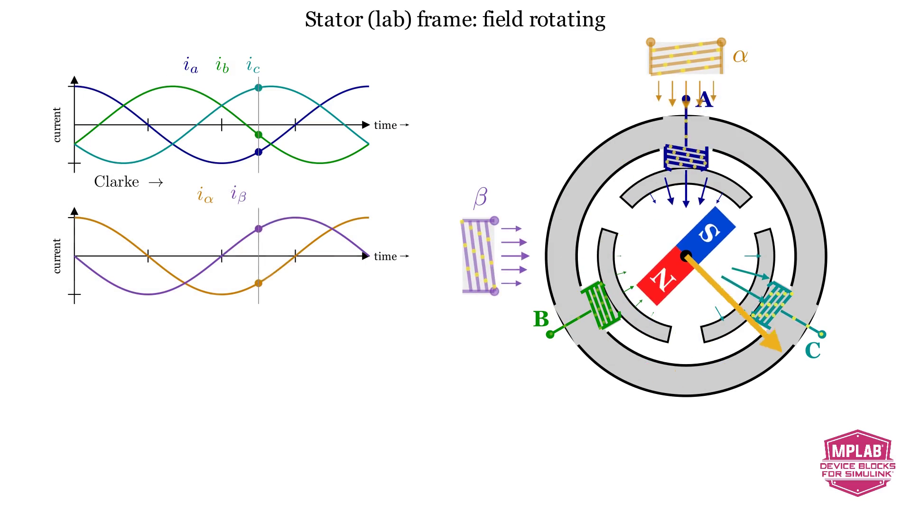
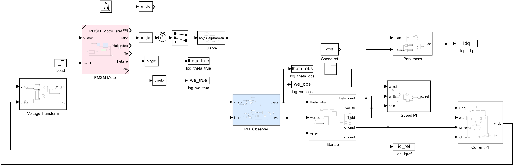
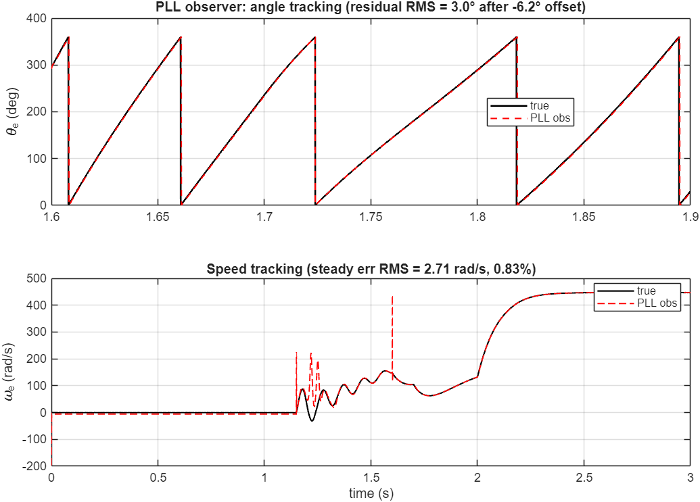
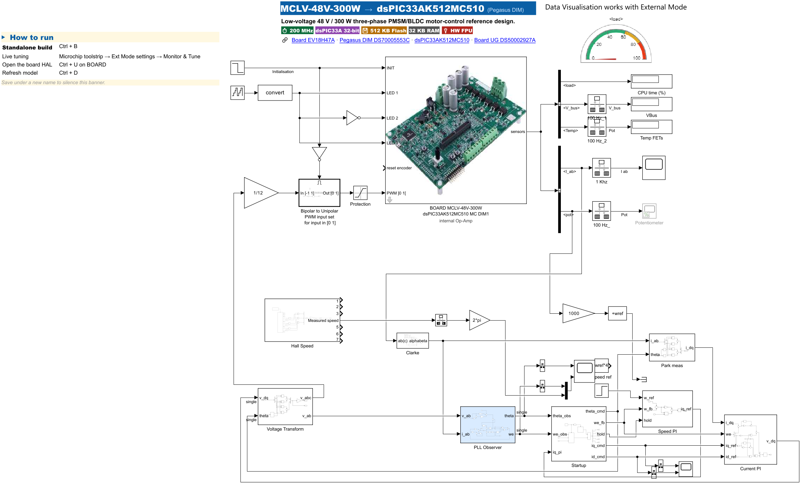

# 07 — Lab 5: PLL sensorless observer (simulation → hardware)

**Goal:** run a **PLL sensorless observer** inside a full **closed-loop FOC** drive — first in
**simulation** against the identified motor model, then on the **real motor**. The observer
estimates the rotor angle from **phase currents + applied voltage only** (no Hall).

**Time:** ~40 min · **Build+flash:** 💻 simulation, then ✅ build & flash the HW solution
**Folder:** `Lab_v2\Lab5_ObserverPLL\`

> ⚠️ The motor spins in the hardware part. Re-read `01` §Safety. Start at low speed, keep a hand
> near the PSU switch.

---

## Why this lab

Hall sensors cost money and can fail. A **PLL observer** locks onto the phase of the motor's
**back-EMF** and outputs the rotor angle `theta` and electrical speed `we` — from signals you
already have (`v_αβ`, `i_αβ`). In simulation the model also knows the *true* angle, so you can
**measure** how well the observer tracks before trusting it on hardware.

> 🎬 The observer works in the **αβ / dq** frames. If Clarke/Park is new, watch the short
> `ClarkePark` animation (`Animations/teaching_scenes/ClarkePark.mp4`).
>
> 

**One idea, three loops:** the estimated angle feeds the FOC just like a sensor would.

```
 i_abc ─Clarke─▶ i_αβ ─┐
                       ├─▶ PLL observer ─▶ theta, we ─▶ Park / Speed & Current PI ─▶ v_dq ─▶ motor
 v_dq  ─▶ v_αβ ────────┘                        ▲
                                    startup: I-f open-loop, hand over at t_ho
```

The drive starts **open-loop (I-f)** — a fixed current at a ramping angle — until the back-EMF is
large enough for the observer to lock; then it **hands over** to the observer-based closed loop.

---

## Part A — Simulation

1. Load parameters and open the simulation model:

   ```matlab
   cd 'D:\26061_MTR6\Lab_v2\Lab5_ObserverPLL'
   startup_lab5           % loads plant + PLL + FOC params
   open PLL_FOC_Simulation_single.slx
   ```

   The **PMSM Motor** (pink) spins under the FOC loops; the **PLL Observer** (blue) watches `v_αβ`
   / `i_αβ`; the model logs the observer's `theta_obs` / `we_obs` **and** the plant's true
   `theta_true` / `we_true` so you can compare.

   

2. Click **Run** (▶). The sim is **3 s**: I-f open-loop startup, hand-over to the observer, then a
   speed step. Plot the logged angle and speed (observer vs true):

   

3. Read the plots:
   - **Angle** (top): after hand-over the estimated angle tracks the true angle with a small
     residual; a constant **load-angle** offset is normal — what matters is that the two ramps stay
     parallel.
   - **Speed** (bottom): the flat start is the I-f phase; after hand-over the observer should lock,
     and in this simulation the estimated speed tracks the reference through the step.

> ✅ **Checkpoint (measured):** after hand-over the residual **angle error is ≈ 3° RMS** (load-angle
> offset removed) and the **speed error is < 1 %**. The estimate contains **no** non-finite values.
> Everything runs discrete at **20 kHz** (`Ts = 50 µs`) — the same rate as on the chip.

---

## Part B — Hardware

The hardware model is the **same** FOC + PLL observer, wired to the MCLV-48V-300W board (PWM,
current sensing via the DIM's internal op-amps, live tuning over External Mode).

- **Student model** — `PLL_FOC_33AK512MC510_MCLV_48V.slx`: starts from the board template and runs
  an **open-loop rotating field** so you can check wiring and PWM at low speed / low risk (under the
  safety procedure) first.
- **Solution model** — `PLL_FOC_33AK512MC510_MCLV_48V_solution.slx`: the complete PLL sensorless FOC.



1. Power the board + motor (24 V, instructor current limit, output **ON**).
2. `open PLL_FOC_33AK512MC510_MCLV_48V_solution.slx`, then click **Monitor & Tune** (External Mode).
   This builds, flashes, and connects (~3–4 min the first time).
3. Give a small speed reference. The drive runs I-f, hands over to the PLL observer, and closes the
   loop. Watch the `I ab`, `V_bus`, and speed scopes.

> **What changed from sim to hardware** (kept minimal, all in the solution): 2-current Clarke
> (floating neutral), de-tuned speed/current PI for a safe first spin-up, `iq` reference clamped to
> `iq_max`, and a first-second board-init phase (MOSFETs at 50 % duty while the ADC settles). You do
> **not** edit these — they are set in the solution.

> ✅ **Checkpoint:** if the run succeeds, the motor should spin steadily at low speed and the speed
> scope should follow your reference qualitatively. Do **not** read the simulation's 3° / <1 % figures
> off the hardware scope — those are simulation metrics, not a hardware-accuracy guarantee.

---

## Tip: start from the student model

Bring up the **student** model (`PLL_FOC_33AK512MC510_MCLV_48V.slx`) first — its open-loop rotating
field lets you confirm wiring, PWM, and current sensing at low speed / low risk (under the safety
procedure) before running the full closed-loop
solution. If a build slips, open the `*_solution.slx` and keep moving.

---

## What you learned

- A PLL observer estimates rotor angle from **currents + applied voltage** only, and can close a
  full FOC loop with **no Hall sensor**.
- An **I-f open-loop startup** gets the motor moving until the back-EMF is large enough to lock.
- The **same** discrete control structure and 20 kHz sample rate run in simulation and on the chip,
  with hardware-specific I/O and safety adaptations — Model-Based Design end to end.

Continue to **`08_Lab5bis_MCB_DualModel.md`** — a sensorless FOC drive built from the Motor Control
Blockset's ready-to-use blocks (an SMO observer, vs the PLL here), with a target + host model workflow
(optional, advanced).

---

> 📌 **Pinout reference** — which DIM/MCU pin carries each signal (motor phases, Hall, ADC, PWM, LED, UART):
> [**MCLV-48V-300W + dsPIC33AK512MC510 DIM viewer**](https://mplab-blockset.github.io/MPLAB-Device-Blocks-for-Simulink/tools/dim_viewer/%23dim=dsPIC33AK512MC510%26bb=MCLV%26sort=function%26grp=1%26alt=0%26mc=1)
